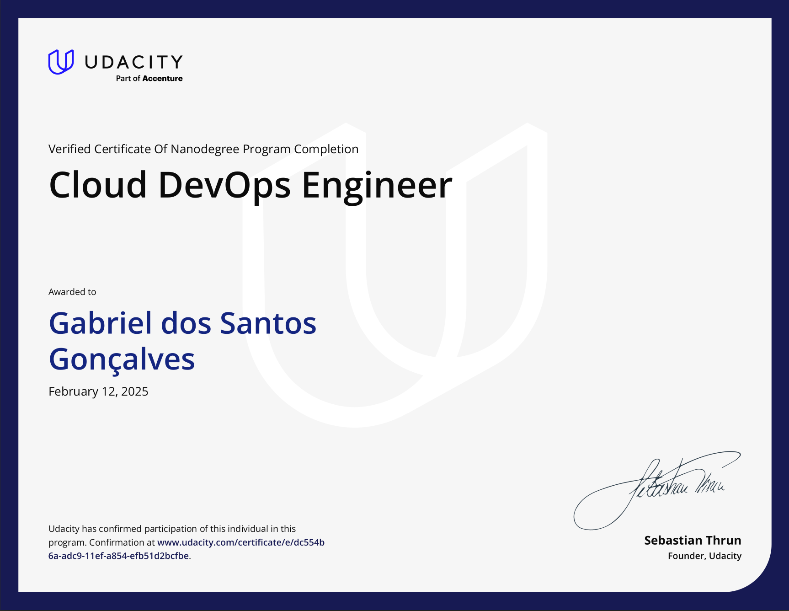

# Udacity Cloud Devops Engineer Nanodegree
My personal repository for developing the projects related to Udacity Cloud DevOps Engineer Nanodegree.

## Project 1 - AWS Static Website hosting with S3
This project demonstrates the deployment of static websites on AWS using Infrastructure as Code (IaC) with Terraform. It showcases a streamlined approach to hosting static content (HTML, CSS, and JavaScript files) using Amazon S3, enhanced by CloudFront's CDN capabilities for improved global content delivery and reduced latency. The implementation provides a practical example of managing cloud infrastructure through code, featuring automated setup of S3 bucket configurations and CloudFront distributions. By following this template, developers can quickly deploy and manage scalable, cost-effective static website hosting solutions while maintaining infrastructure consistency through version control.

## Project 2 - Deploying a Web Application with AWS CloudFormation
This project implements an automated AWS infrastructure deployment using CloudFormation as the Infrastructure as Code (IaC) solution. The implementation follows a modular approach, separating network and application stacks to enable independent management by different teams. The solution includes comprehensive cloud architecture diagrams and CloudFormation templates that automate the provisioning of AWS resources, allowing development teams to spin up and tear down testing environments on demand. By leveraging IaC principles, the project ensures consistent and repeatable deployments while facilitating efficient environment management for testing purposes.

## Project 3 - Microservices with Kubernetes
This project demonstrates the operationalization of a microservices-based analytics API for a coworking space management system using Kubernetes on AWS. The implementation focuses on deploying a production-ready solution that enables business analysts to access user activity data through a secure and scalable infrastructure. The project leverages Amazon EKS for container orchestration, integrates with a PostgreSQL database for data persistence, and implements CI/CD automation through AWS CodeCommit. By following DevOps best practices, the solution ensures automated deployment pipelines, efficient container management, and seamless integration between the microservice components, providing a robust platform for analyzing coworking space usage patterns.

[Link for Project 3 Github repository](https://github.com/GabrielSGoncalves/udacity_devops_nanodegree_project3_k8s)

## Project 4 - CICD with GitHub Actions
This project implements a comprehensive CI/CD pipeline using GitHub Actions for a web application consisting of a React frontend and Flask backend. The solution automates the development workflow by implementing parallel testing, building, and deployment processes for both applications. The pipeline features separate continuous integration workflows that trigger on pull requests, performing linting and testing in parallel, followed by conditional build steps. The continuous deployment workflows, triggered on main branch pushes, extend this automation by building Docker images tagged with git SHAs and deploying them to a Kubernetes cluster. The implementation ensures code quality through automated checks, accelerates the release cycle, and maintains deployment consistency through infrastructure as code practices.

[Link for Project 4 Github repository](https://github.com/GabrielSGoncalves/udacity_devops_nanodegree_project4_github_actions)

## Nanodegree Certification

