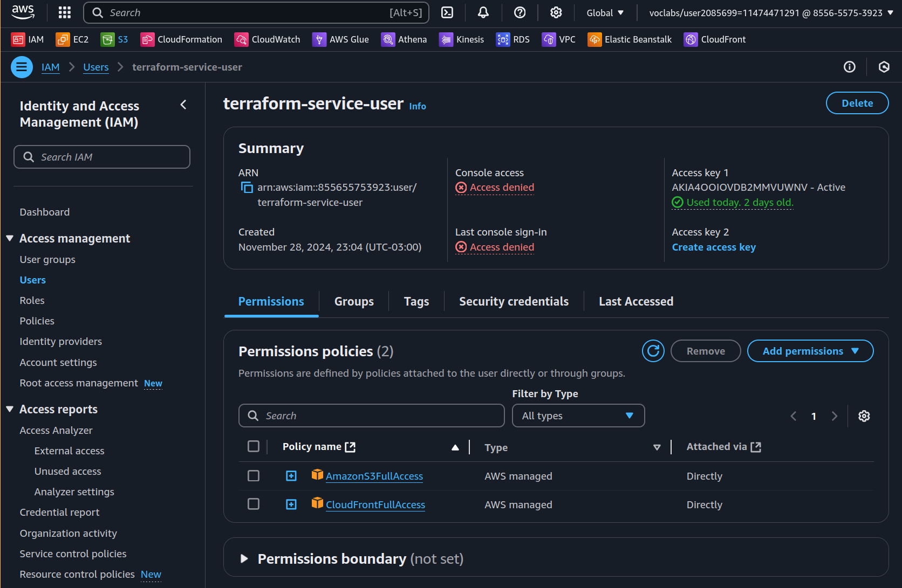
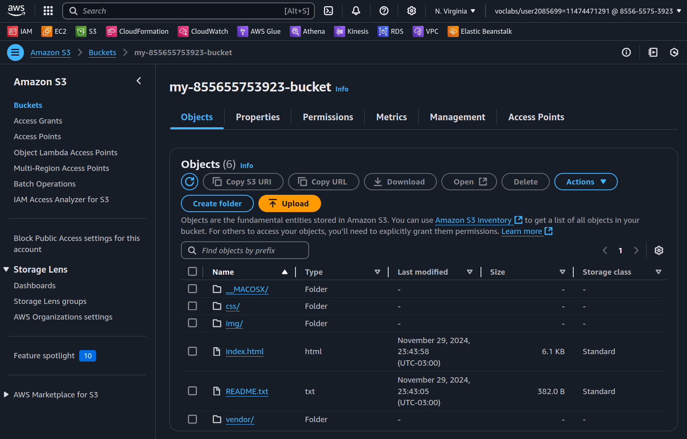
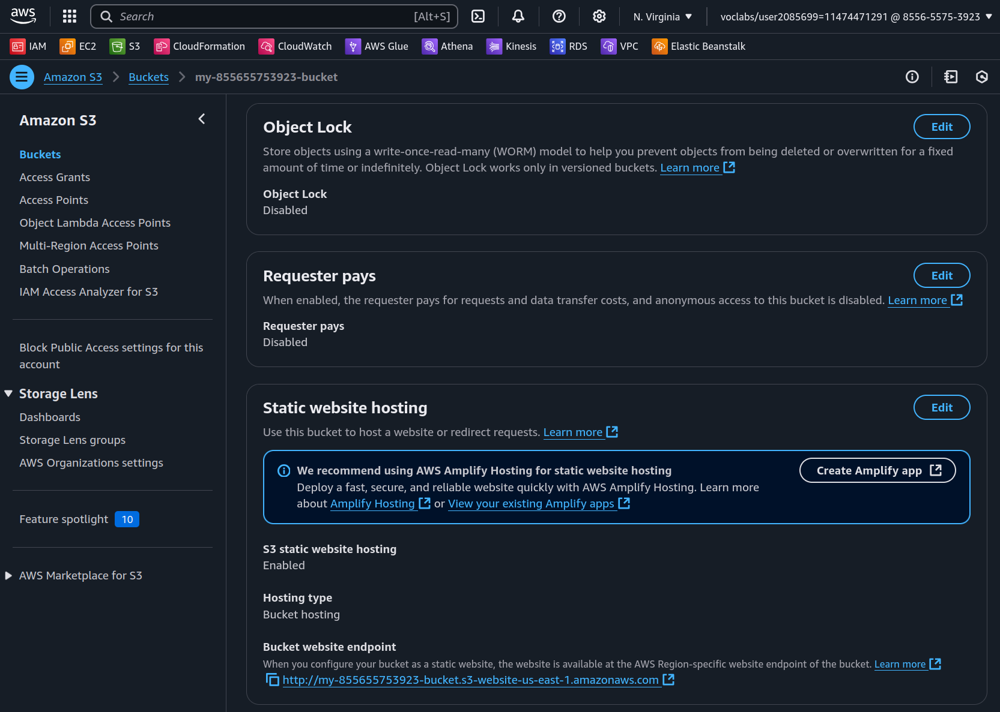

# Project 1 - Deploy Static Website on AWS
## Overview
Hosting websites is one of the most basic tasks related to cloud infrastructure. For static websites, composed basically of HTML, CSS and JavasScript files (no backend), AWS offers a simple way of hosting it using S3. CloudFront is a content delivery service that can also help lowering the latency for users from different regions. 

We are going to explore these two AWS services in a static website deployment. In order to have control over the cloud infrastructure created for the project, I'll be using Terraform as the Insfrastructure as Code (IaC) framework.

## Objective
1. Deploy a static website using AWS S3.
2. Use CloudFront as content delivery network (CDN) service.

## Creating a AWS service user for using with Terraform
In order to use Terraform to define the AWS infrastructure, we need to create an AWS service user using IAM, and grant only the necessary permissions to access the services used in the project. This way we would follow the recommended AWS least privilege principle.
To do it, I used the AWS console (logged in using the student user account provided by Udacity) and created the user `terraform-service-user` using IAM. I granted full access to S3 and CloudFront, the two services used in this project (bellow).



Access and Secret Keys were also generated for this user, to be used to configure the AWS CLI and Terraform on the local repository.

## Configuring the AWS CLI
With the service user created and AWS access and secret keys, we configured a new profile on AWS CLI in order to interact with my AWS account programatically. I named the profile as `udacity`, to differentiate from the `default`, from my personal AWS account.
```bash
aws configure --profile udacity
```

I added the respective access key, secret key and region, as required from the terminal.

With the AWS CLI configured, I have access to all services with granted access for the service user. For instance, I can verify my AWS project account provided by Udacity with the following command:
```bash 
aws sts get-caller-identity --query Account --output text --profile udacity
```

## Configuring Terraform
To install Terraform we followed the official tutorial on the [Harshicorp page](https://developer.hashicorp.com/terraform/install).

Next, we created a subfolder inside our project repository called `terraform`, to store all the configuration files. The final project structure would look like this:
```text
project1_aws_static_website
└──terraform
  ├── cloudfront.tf
  ├── provider.tf
  ├── s3.tf
  ├── terraform.tfstate
  ├── terraform.tfstate.backup
  ├── terraform.tfvars
  └── variables.tf
```
To define the AWS credentials, we created the files:

`terraform.tfstate`
```tf
aws_access_key = "<ACCESSKEY>"
aws_secret_key = "<SECRETKEY>"
aws_region     = "us-east-1"
```

`variables.tf`
```tf
variable "aws_access_key" {
  description = "AWS Access Key"
  type        = string
  sensitive   = true
}

variable "aws_secret_key" {
  description = "AWS Secret Key"
  type        = string
  sensitive   = true
}

variable "aws_region" {
  description = "AWS Region"
  type        = string
  sensitive   = true
}
```

`providers.tf`
```tf
provider "aws" {
  region     = var.aws_region
  access_key = var.aws_access_key
  secret_key = var.aws_secret_key
}
```

Only the file `terraform.tfstate` won't be tracked using git, as it store sensitive data from the AWS access and secret keys.

The Terraform resources were defined in the files `cloudfront.tf` and `s3.tf` (details bellow).

## Creating the S3 bucket
To create the S3 bucket I can use the Terraform resource block bellow:
```tf
resource "aws_s3_bucket" "my_bucket" {
  bucket = "my-855655753923-bucket"

  tags = {
    project = "s3 static website"
  }
}
```

To create AWS infrastructure with Terraform, we follow the commands after every new resource added to the repository:
```text
terraform init
terraform plan
terraform apply
```

## Uploading files to S3
The project description required that I used the provided files for static website:
[udacity-starter-website.zip](https://drive.google.com/file/d/15vQ7-utH7wBJzdAX3eDmO9ls35J5_sEQ/view)
After downloading it to my local Github project repository, I have extracted the folder and uploaded it to my S3 bucket usign AWS CLI:
```bash
unzip udacity-starter-website.zip -d udacity-starter-website
cd udacity-starter-website
aws s3 sync . s3://my-855655753923-bucket --profile udacity
```

The uploaded took a few minutes, as there are a few thousand small files on the extracted folder. The picture bellow illustrates the S3 after the upload.



## Configuring S3 for static website
Next step consists in allowing public access to the S3 bucket, creating a bucket policy and also configuring the index and error files for the website. Again we leveraged Terraform resources:
```tf
resource "aws_s3_bucket_public_access_block" "bucket_public_access" {
  bucket = aws_s3_bucket.my_bucket.id

  block_public_acls       = false
  block_public_policy     = false
  ignore_public_acls      = false
  restrict_public_buckets = false
}

resource "aws_s3_bucket_policy" "bucket_policy" {
  bucket = aws_s3_bucket.my_bucket.id
  policy = jsonencode({
    Version = "2012-10-17"
    Statement = [
      {
        Sid = "AddPerm"
        Effect = "Allow"
        Principal = "*"
        Action = ["s3:GetObject"]
        Resource = ["arn:aws:s3:::my-855655753923-bucket/*"]
      }
    ]
  })
}

resource "aws_s3_bucket_website_configuration" "website_config" {
  bucket = aws_s3_bucket.my_bucket.id

  index_document {
    suffix = "index.html"
  }

  error_document {
    key = "index.html"
  }
}
```
We can see the changes made to the S3 bucket from the AWS console (bellow):


And finally, if you go to the bucket website endpoint, you are able to see the Website already available.


All the Terraform code blocks described above can be found in file `s3.tf`.

## Distributing Website via CloudFront
To lower the latency our users can access out website hosted in S3, we are going to use CloudFront as a CDN service. CloudFront leverages AWS Edge locations, caching data for our website on locations closer to our users. The Terraform resources needed to associating a CloudFront distribution to our S3 endpoint can be found on the file `cloudfront.tf`.

```tf
resource "aws_cloudfront_origin_access_identity" "website_oai" {
  comment = "OAI for S3 static website"
}

resource "aws_cloudfront_distribution" "s3_website_distribution" {
  enabled             = true
  default_root_object = "index.html"

  origin {
    domain_name = aws_s3_bucket.my_bucket.bucket_regional_domain_name
    origin_id   = aws_s3_bucket.my_bucket.id

    s3_origin_config {
      origin_access_identity = aws_cloudfront_origin_access_identity.website_oai.cloudfront_access_identity_path
    }
  }

  default_cache_behavior {
    allowed_methods  = ["GET", "HEAD", "OPTIONS"]
    cached_methods   = ["GET", "HEAD"]
    target_origin_id = aws_s3_bucket.my_bucket.id

    forwarded_values {
      query_string = false
      headers      = []

      cookies {
        forward = "none"
      }
    }

    viewer_protocol_policy = "redirect-to-https"
    min_ttl                = 0
    default_ttl            = 3600
    max_ttl                = 86400
  }

  viewer_certificate {
    cloudfront_default_certificate = true
  }

  restrictions {
    geo_restriction {
      restriction_type = "none"
    }
  }
}
```

CloudFront takes a few minutes to become available, generating a new Distribution domain name that can be browsed as a regular website. In our case it was the `https://d3f1ihb19kc19x.cloudfront.net`.

## Customizing the website
I made a small change on the main page for our website, replacing the title "Travel Blog" with "Gabriel's Travel Blog", and also the background picture.


## Cleaning up the resources
To remove the resources created with Terraform we just need to execute the `terraform destroy` command. The only exception with this approach is for S3 bucket, which won't be removed as we have uploaded files to it. So, we first need to empty the S3 bucket, before removing the resources:
```bash
aws s3 rm s3://my-855655753923-bucket --recursive --profile udacity
```
And finally we can execute `terraform destroy`.

## Final thoughts
This project has showed the potential of using S3 to host an static website
We also 