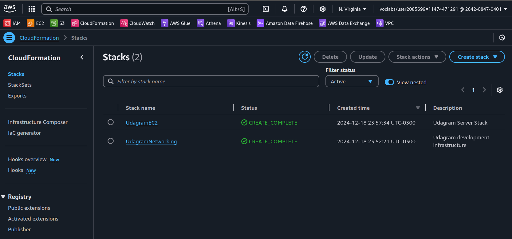
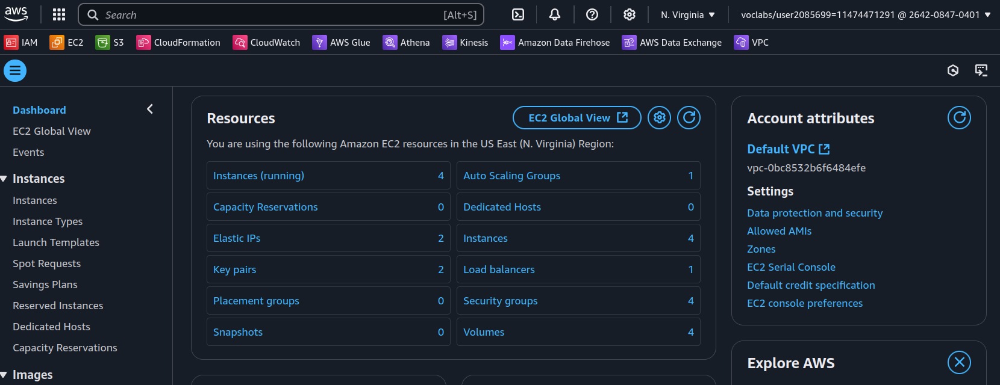
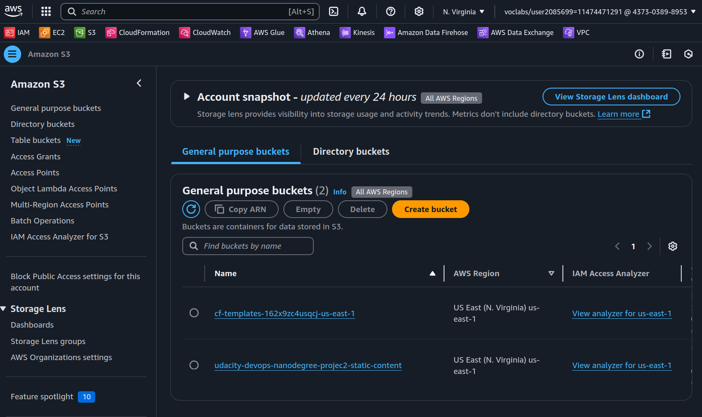

# Project 2 - High-availability web app using CloudFormation
## Overview
In this project we are going to explore CloudFormation as the IaC framework for deploying an web application in AWS. We will also design a cloud infrastructure diagram to illustrate the desired architecture.

## Project Scenario
The project official description is the following:
```
Your company is creating an Instagram clone called Udagram, and the requirement is to deploy this new application to the AWS infrastructure using Infrastructure as Code.

You have been tasked with provisioning the required infrastructure and deploying a dummy application, along with the necessary supporting software.

Since the underlying network infrastructure will be maintained by a separate team, you must create independent stacks for the network infrastructure and the application itself.

Infrastructure spin up and tear down needs to be automated so that each team can create and discard testing environments on demand.
```


## Objectives
Based on the description, we have the following project objectives:
1. Create a diagram for the web app cloud architecture
2. Deploy the web application on AWS using CloudFormation


## Diagram
In order to facilitate the implementation of the Cloud Solution request on the project, we have designed a diagram that represents all the used AWS resources.


### Key Architecture Components
#### 1. Network Design
- VPC: 10.0.0.0/16 IP range
- Availability Zones: 2 AZs used for high availability
- Subnets:
    - 2 Public Subnets (10.0.0.0/24, 10.0.1.0/24)
    - 2 Private Subnets (10.0.2.0/24, 10.0.3.0/24)

#### 2. Network Flow
- Internet Gateway attached to VPC
- Public Subnets have direct internet access
- NAT Gateways in public subnets provide internet access for private subnets
- Route Tables configured for public and private subnet routing

#### 3. High Availability Features
- Subnets spread across two Availability Zones
- Separate NAT Gateways for each AZ
- Independent route tables for each subnet type

Next, we are going to use CloudFormation to implement the described cloud architecture.

## Cloud Infrastructure resource requirements
Bellow is the requirements that were demanded by the client:

### Network and Servers Configuration

1. You can deploy to any region.
2. You'll need to create the networking infrastructure for your solution, including a new VPC and four subnets: two public and two private, following high availability best practices.
3. Use a parameters JSON file to pass CIDR blocks for your VPC and subnets.
4. You'll need to attach Internet and NAT gateways for internet access.
5. You'll need to use Launch Templates to create an Autoscaling Group for your application servers in order to deploy four servers, two located in each of your private subnets.
6. Your CPU and RAM requirements will be covered with t2.micro instances, so use this instance type. The Operating System to be used is Ubuntu 22.
7. The application must be exposed to the internet using an Application Load Balancer.

## Deploying the Cloud Infrastructure
Our cloud infrastructure is defined in the following files:
- stack_templates/networking.yml
- stack_templates/ec2.yml
- parameters/networking-parameters.json
- parameters/ec2-parameters.json

We have created a bash script to help us in the process of creating and deleting CloudFormation infrastructure. The script can be found in `scripts/run.sh`.

We first deployed our VPC and associated networking resources using the `run.sh` script:
```bash
scripts/run.sh create-stack us-east-1 UdagramNetworking stack_templates/networking.yml parameters/networking-parameters.json
```

After a few minutes with the stack showing the status `CREATE_COMPLETE`, we followed with the deployment of our servers.

```bash
scripts/run.sh create-stack us-east-1 UdagramEC2 stack_templates/ec2.yml parameters/ec2-parameters.json
```

## Resources created
The images below illustrate the AWS resources created through the above CloudFormation stacks.

### CloudFormation stacks
The networking and EC2 stacks with `CREATE_COMPLETE` status. 


### EC2 Resources
All the EC2 resources like EC2 Instances, Auto Scaling Groups, Key Pairs, Load Balancers, can be found listed in the EC2 overview page after CloudFormation stack creation.


### S3 buckets
The picture bellow shows the S3 bucket "udacity-devops-nanodegree-projec2-static-content" we created for storing static content.



## Deleting resources
After using the cloud infrustructure designed in this project, we may want to delete it, in order to avoid cloud cost. We can also use our `run.sh` script for it:
```bash
scripts/run.sh delete us-east-1 UdagramEC2
scripts/run.sh delete us-east-1 UdagramNetworking
```

## Final thoughts
The current project has demonstrated how powerful CloudFormation is a IaC framework. With just a few YAML and JSON files, we can deploy a complex Cloud Infrastructure with different services integrated in the same architecture, making the deployment process replicable between environments and teams.

## References
- [GitHub repository with project templates](https://github.com/udacity/-cd12352-Deploy-Infrastructure-as-Code-project/blob/main/starter/README.md)