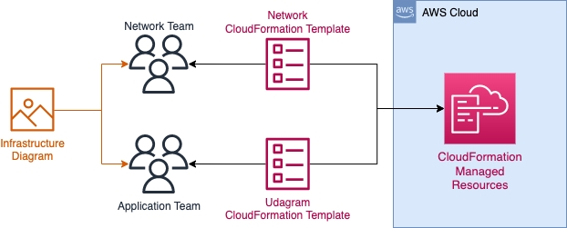

# Project 2 - High-availability web app using CloudFormation
## Overview
In this project we are going to explore CloudFormation as the IaC framework for deploying an web application in AWS. We will also design a cloud infrastructure diagram to illustrate the desired architecture.

## Project Scenario
The project official description is the following:
```
Your company is creating an Instagram clone called Udagram, and the requirement is to deploy this new application to the AWS infrastructure using Infrastructure as Code.

You have been tasked with provisioning the required infrastructure and deploying a dummy application, along with the necessary supporting software.

Since the underlying network infrastructure will be maintained by a separate team, you must create independent stacks for the network infrastructure and the application itself.

Infrastructure spin up and tear down needs to be automated so that each team can create and discard testing environments on demand.
```


## Objectives
Based on the description, we have the following project objectives:
1. Create a diagram for the web app cloud architecture
2. Deploy the web application on AWS using CloudFormation


## Diagram
In order to facilitate the implementation of the Cloud Solution request on the project, we have designed a diagram that represents all the used AWS resources.


-> Describe overview of the architecture

## Cloud Infrastructure resource requirements
Bellow is the requirements that were demanded by the client:

### Network and Servers Configuration

1. You can deploy to any region.
2. You'll need to create the networking infrastructure for your solution, including a new VPC and four subnets: two public and two private, following high availability best practices.
3. Use a parameters JSON file to pass CIDR blocks for your VPC and subnets.
4. You'll need to attach Internet and NAT gateways for internet access.
5. You'll need to use Launch Templates to create an Autoscaling Group for your application servers in order to deploy four servers, two located in each of your private subnets.
6. Your CPU and RAM requirements will be covered with t2.micro instances, so use this instance type. The Operating System to be used is Ubuntu 22.
7. The application must be exposed to the internet using an Application Load Balancer.


## Final thoughts

## References
- [GitHub repository with project templates](https://github.com/udacity/-cd12352-Deploy-Infrastructure-as-Code-project/blob/main/starter/README.md)